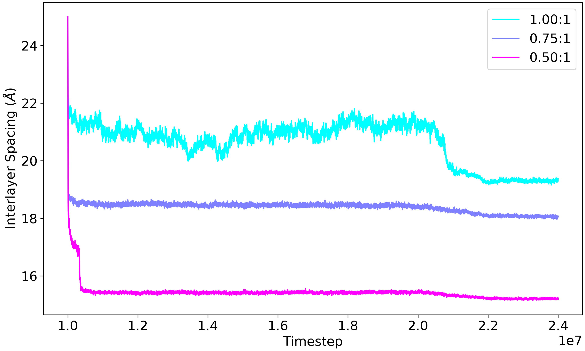

# plotting-tools

This package contains scripts that create the types of figures which are commonly required in our line of work. This is by no means a comprehensive collection of all the tools you will ever need, but it does serve as a head start to automate some of the most generalizable tasks. It can be hard to strike a balance between ease of use and customizability so in this work the focus is to provide a highly accessible platform which you can fork and add necessary customizations to.


## Getting Started

__1) Install Anaconda__

This project uses [Anaconda](https://www.anaconda.com/download) to manage Python versions and external dependencies. Use the link to download the version which is compatible with your operating system.

__2) Clone this repository__

To make this code available on your local computer you will need to clone it with [git](https://git-scm.com/docs/user-manual). Use the following command line snippet to do so. If you run into a problem with SSH keys follow this [tutorial](https://docs.github.com/en/authentication/connecting-to-github-with-ssh/generating-a-new-ssh-key-and-adding-it-to-the-ssh-agent).

```bash
git clone git@github.com:phillpot-group/plotting-tools.git && cd plotting-tools
```

__3) Activate the conda environment__

The environment specification for this package is contained in [environment.yml](environment.yml). To build this environment on a new installation use the following command line snippet.

```bash
conda env create -f environment.yml
```

With the environment iinstalled on your local system you can now activate it with the following command line snippet.

```bash
conda activate plotting-tools
```

:warning: __NOTE:__ You need to activate the environment every time you intend to use one of the scripts.

## Examples

Each of the scripts contained in this repository has an example in the section below. Not all of the features of each script will necessarily be shown in each example. Remember that each script has a `--help` flag which will print out all of its functionality.

### [plot-lammps-log.py](scripts/plot-lammps-log.py)

This script plots the results of a LAMMPS simulation that are recorded in the thermodynamic log file. The log file is structured according to the [`thermo_style` command](https://docs.lammps.org/thermo_style.html). You may plot multiple properties from the same input file __OR__ one property from multiple input files on the same figure. Doing both at once gets very busy and difficult to manage.

:warning: __NOTE:__ This script requires some manual preprocessing. You must remove the lines before the property headers and the lines after the final result is logged. Unfortunately this cannot be automated. The __first__ lines of the file should resemble the snippet below.
```
Step PotEng KinEng TotEng Temp Press Lx Ly Lz
10000000   -426912.05    5143.4244   -421768.63    349.36471    1517.6243    58.648234    50.784771    25.000006
10001000   -424814.66    6497.2063   -418317.45    441.31972    1944.3129    58.648234    50.784771    24.494777
```

The __last__ lines of the file should resemble the snippet below.
```
23999000    -427656.8    4473.5478   -423183.25    303.86365     2940.087    58.648234    50.784771    19.312015
24000000   -427566.49    4397.7291   -423168.76     298.7137    4548.3145    58.648234    50.784771    19.373656
```

Any number of thermodynamic properties can be included in the file but it is __required__ that the `Step` property is included because that data will be plotted along the *X* axis.

The example image was generated with the following command line snippet. Input filenames have been removed to keep examples concise.
```bash
python scripts/plot-lammps-log.py -i <file1> <file2> <file3> -p Lz -y "Interlayer Spacing \$(\AA)\$" -l "1.00:1" "0.75:1" "0.50:1" --cmap cool
```



### [plot-vasp-neb.py](scripts/plot-vasp-neb.py)

## Developer Notes

* To keep code style consistent, be sure to run `make fmt` to format the codebase.

* Whenever you add a new dependency be sure to run `make exportenv` to update the [`environment.yml`](environment.yml) file so users will be able to build with the most up to date requirements.

* These tasks are automated by [GitHub actions](https://github.com/features/actions) so if you add new functionality that needs to be regularly maintained it is recommended to automate it in the same way.